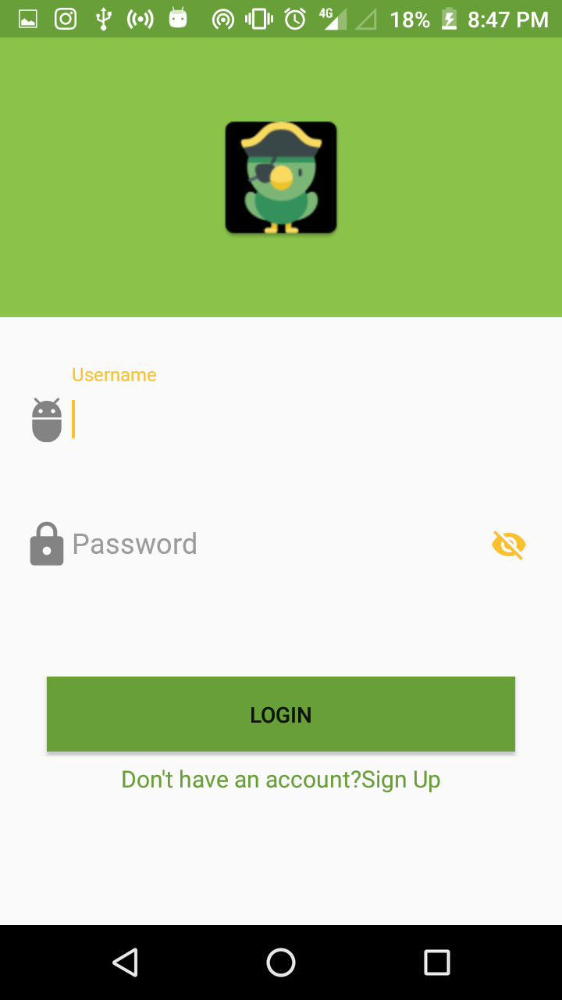
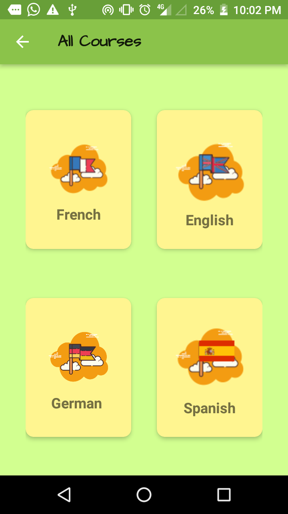

# LanguageSel
This app allows the user to learn some fundamentals of different languages by allowing user to learn a set of basic/daily words.
## Login

One can login to the app whose backend is handled by Firebase.Firebase sends email verification link to the app.One cannot proceed to the
app without first verifying the email address.

## Options The User Can Perform
An intent opens up asking the user to select the language.

### Four languages availabe:
1.Spanish
2.English
3.French
4.German

### Image

The corrosponding language selected by the user allows him to access a set of basic questions related to:
Food,Family,Utilities,Greetings.
User can even write in english and translate it in the corrosponding language.

### Navigation Drawer
### Image

This drawer provides user with the options like sign Out,PROFILE,CHAT,share the app,Accessing some other course(among the four courses available).

## No Internet Connection:
A dialog box asking the user to shut the app down opens up, incase no internet is observed.
